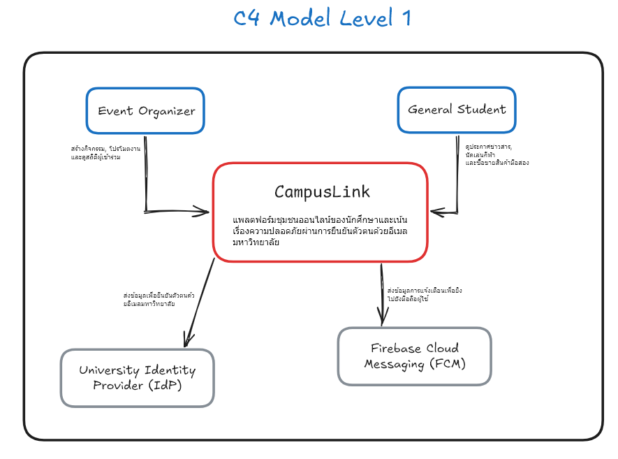
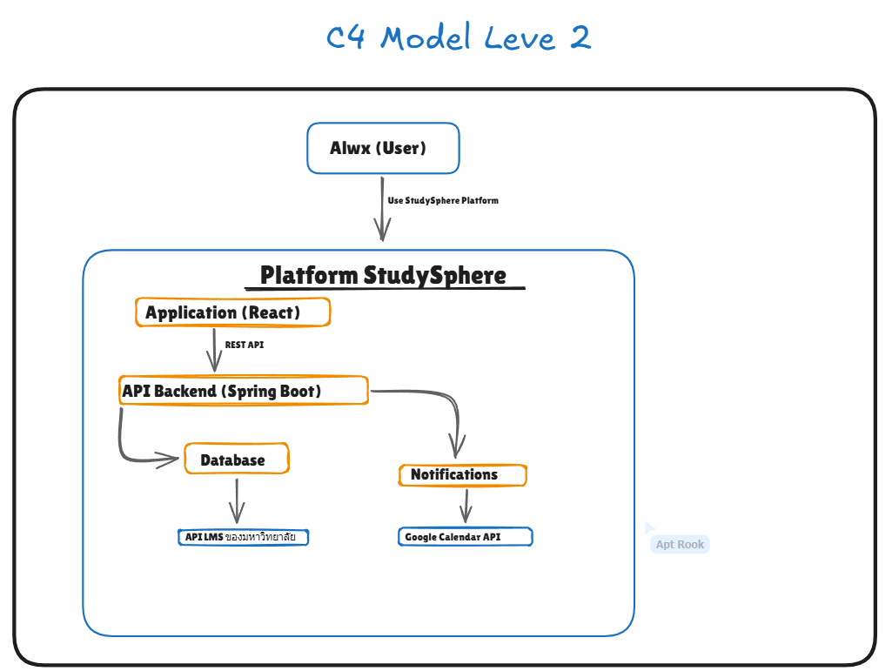

(สำหรับใส่ UML, Data Design, และแผนภาพระบบ)
# 📐 Architecture & UML Diagrams 
ให้นิสิตวางแผนภาพ Use Case, Class Diagram และสถาปัตยกรรมระบบที่นี่

# Project Architecture

This directory contains key architectural diagrams and decision records for the project.

## C4 Model: System Context (Level 1)

## C4 Model: Container (Level 2)

## Architectural Decision Records (ADRs)

- [ADR-001: Selection of Core Technology Stack](./adr/0001-tech-stack-selection.md)